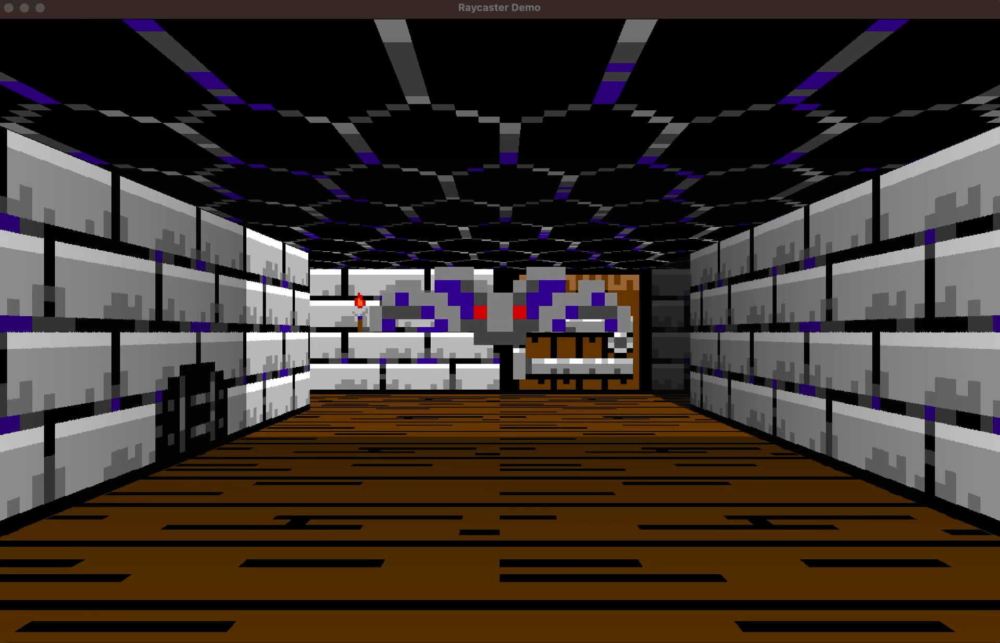

# A Rust based Raycaster engine

This is a full featured raycaster engine.

## Features

* Textured or colored walls, ceiling and floor
* fog color and distance
* Sprites
* Animation support
* Multi-threaded or single-threaded rendering
* Tile based lighting

## Todo

* Doors

## Multi-threaded Rendering

As a raycaster works with stripes of pixels (instead of slices) the internal rendering stores the image 90 percent rotated so that it can work with slices. This helps with memory access and makes it possible to use rayon for multithreading. The image is than rotated back into the destination frame, this too is done in parallel.

Multithreaded rendering of an 1280x800 image is done in about 2-3 ms on my machine. Single threaded rendering takes about 7-8 ms. The renderer should be fast enough to handle 4k resolutions.
